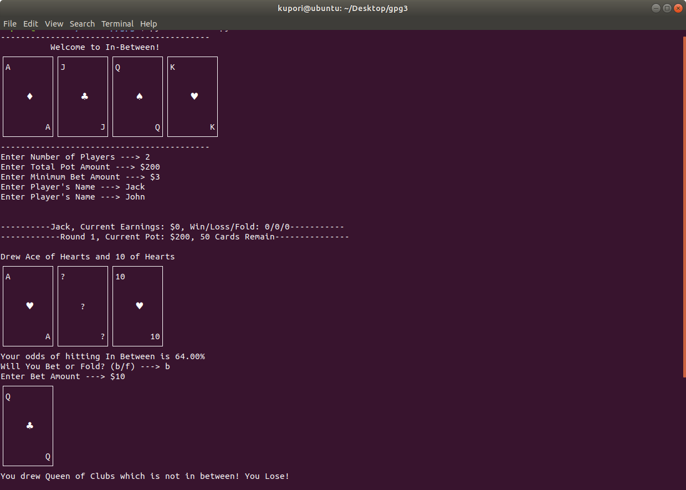

# in_Between_3.6

A simple command line version of the popular card game - In Between / Acey Deucey.

Features an odds calculator.

Requires python 3.6 and a console that can read unicode, use bash.

To play, Run main3.py

references:

https://en.wikipedia.org/wiki/Acey_Deucey_(card_game)

https://codereview.stackexchange.com/questions/82103/ascii-fication-of-playing-cards

